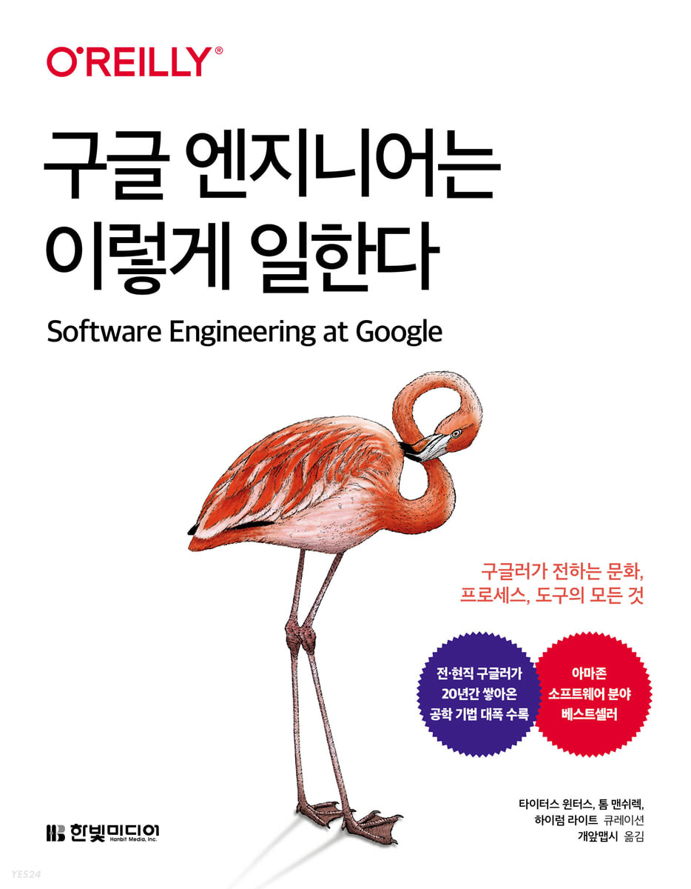
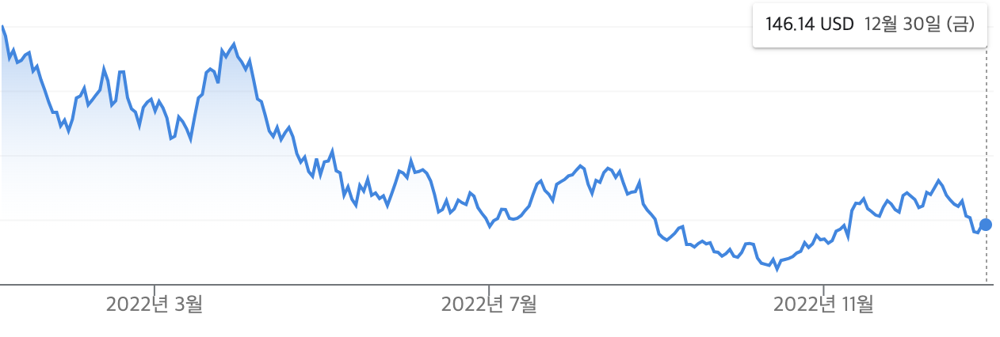

올해는 어떤 한해였나.  
작년 회고를 읽어보니 2021년에는 여러가지 일들이 있었는데 올해는 비교적 그렇진 않았던것 같다. 올해 내 삶의 책갈피는 많지 않았다.

## 회사
작년에 카카오스타일에 입사하고 안정적인 한해를 보냈다는 느낌이다. 회사가 어느정도 규모가 크다보니 당장 내일을 걱정해야하는 스타트업에서 느꼈던 불안함이나 급진적인 분위기는 덜했던것 같다. 반면 재택근무의 영향도 있겠지만 조직의 규모가 클 수록 내가 회사에 기여하는 부분이 작다는 생각도 들고 스타트업의 그 으쌰으쌰하는 느낌이 덜하기도 했다.

하지만 그와는 별개로 올해는 어쩌면 개발자로서 성장하기 위한 고민을 많이했던 해였던것 같다. 전 회사의 동료들이 회사의 사정으로 뿔뿔이 흩어지고, 가까운 사람이 면접을 보고 조직 이동을 하는걸 보니 이직을 한지 얼마되지 않았지만 자연스럽게 그 상황을 다시한번 나에게 대입하게 되었던것 같다. 내가 지금 다른곳에 면접을 본다면 어떻게 나를 소개해야할까? 조직에 더 많이 기여하려면 어떻게 해야할까? 이런 추상적인 질문들에 대해 여러가지로 고민했던 한해 였던것 같다.

때 마침 우리팀에서 같이 일할 개발자를 구인하기 위해 내가 면접에 참여하게 되었고, 같이 일할 사람이 어떤 태도였으면 좋겠는지, 그것을 보기위해 어떤 질문들을 던져야할지 같은 것들에대해 생각해야할 기회가 생겼다. 그러면서 더더욱 내가 인터뷰이에게 던질 질문을 반대로 내가 받았다면 어떻게 대답할지도 고민해보고 연말즈음에는 자연스럽게 부문 리더의 역할을 하기도 했던것 같다.

## 구글 엔지니어는 이렇게 일한다
올해 내게 가장 큰 영향을 준건 단연 “구글 엔지니어는 이렇게 일한다”라는 책이다. 이 책에서 많은걸 느끼고 배웠다. 올해 내게 인사이트를 준 한 문장을 뽑자면 “천재라고 해서 괴짜처럼 행동하는게 용서받는 시대는 지났다. 천재든 아니든 사회성이 부족한 사람은 팀원으로서 적합하지 않다” 라는 구절이다. 이 문장으로 부터 소프트웨어 엔지니어로서 반드시 가치를 만들어내야함에 있어서 다른이와 “함께”만드는 것임을 다시한번 상기했다.

나의 관심사가 좋은 코드, 깨끗한 아키텍처, 가독성… 이런것들에서 지속가능한 소프트웨어, 생산성, 함께 일하고 싶은 동료, 문제의 본질… 이런것들로 옮겨 갔다. (하지만 기술적인 것들에 1차원적인 재미를 느낀다는 사실은 변함없는것 같긴 하다) 
이전까지 한명의 단일 개발자로서 코드에 기여하는것에 대한것들을 고민했다면 올해는 다른 사람들을 더 잘하게 하려면 어떻게 해야 할지, 조직의 생상성을 더하는게 아니라 곱하게 하려면 어떻게 해야하는지를 고민하는게 중요하다는걸 느꼈다.

<small>정말 재밌었던 책!</small>

## 책
올해도 하루에 20페이지씩 책읽기 챌린지를 지속했다. 위에 따로 언급한 “구글 엔지니어는 이렇게 일한다”라는 책은 인생책이라고 말할 정도로 정말 좋았고, 프로그래머의 뇌, 사피엔스, 탤런트 코드등 인사이트를 준 책들이 많았다. 어느샌가 22권 정도의 책을 읽었고 내년에도 꾸준히 할 계획이다. 하지만 2023년에 는 좀 더 주도적으로 책을 읽고싶다. 지금 회고해보니 그저 하루 할당량을 채우기위해 영혼없이 글자를 읽으면서 넘긴 페이지가 많은것 같다. 저자는 무슨말을 하고 있는지, 그래서 그것에 대한 나의 생각이 무엇인지가 중요한것 같다. 그저 글자를 읽으며 흘려보내지 말고 생각하는 힘을 기르자.

## 건강
작년 회고에도 썼지만 내년에 만 30살이 되면서 올해가 진짜 아홉수였다. 딱히 인식하지 않았음에도 안아프던 허리나 무릎에 난생 처음 겪는 통증이 온다던지(다행히 몇 주 쉬니까 나았지만) 간수치가 높아서 두달 정도 다이어트를 했다던지, 코로나에 걸렸다던지... 이런 건강에 이상신호가 오는게 느껴졌다. 분명 아직 젊은 나이임에도 불구하고 확실히 몸상태가 다름을 느꼈다. 인생선배들의 아이고~는 괜히 내는 감탄사가 아니었던것 같다. 관리의 필요성을 실감했다. 그래도 올해 초에 간수치를 낮추기위해 식단 관리를 해서 5kg 정도 다이어트를 한것은 성공적이었어서 뿌듯했다.

## 주식
작년에 주식이 많이 올랐다고 회고에 쓴건 클리셰였던것 같다. 오른만큼 떨어졌고 바닥밑에 지하실이 있었다. 내년엔 오르려나 모르겠다. 엔비디아는 좀 더 힘을 내줬으면 좋겠다.

----

목표를 세워서 단기간에 집중적으로 달리는 스프린트식의 성장은 내게 유용하지 않았던 경우가 많았다. 나는 눈에 보이는 작은 목표를 세우고 하루하루 루틴을 지켜나가되 그걸 오랜기간 꾸준히하는걸 잘하고, 그게 스스로에게 잘 통하는 툴 이라는걸 올해 깨달았다.

새해라고해서 뭔가 시작할 필요는 없는것 같지만, 작게나마 2023년의 목표를 하나 세워보자면 일상의 기록이다. 일한건 티켓으로 남기고, 운동한 날을 체크하고, 읽은 책은 생각을 정리해보려고 한다. 이런것들이 별거 아닌것 같아도 그 다음으로 향하기 위한 동기부여가 되는것 같다. 

지금 내 삶에 큰 불만이 없고 안정적이라고 느끼기 때문에 새해에 더 행복해지려 애쓸 필요는 없는것 같다. 서른이 되는 내년에도 지금까지처럼 꾸준하자.