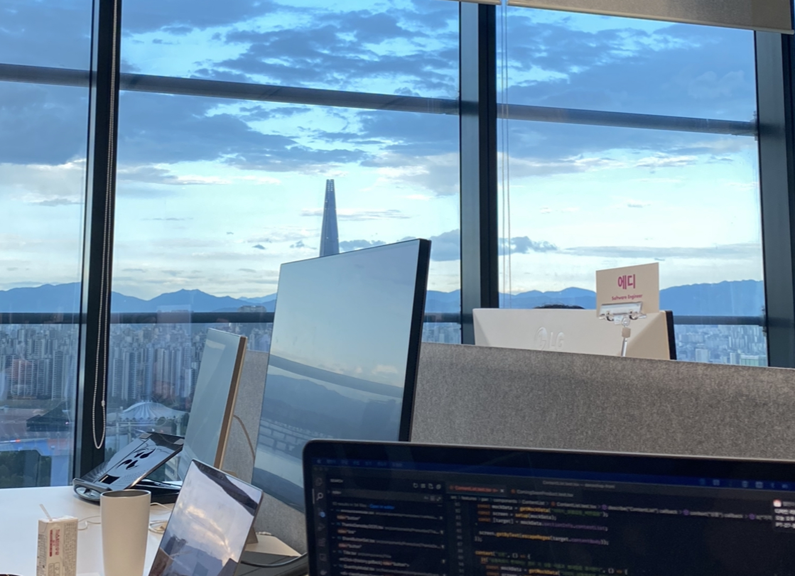
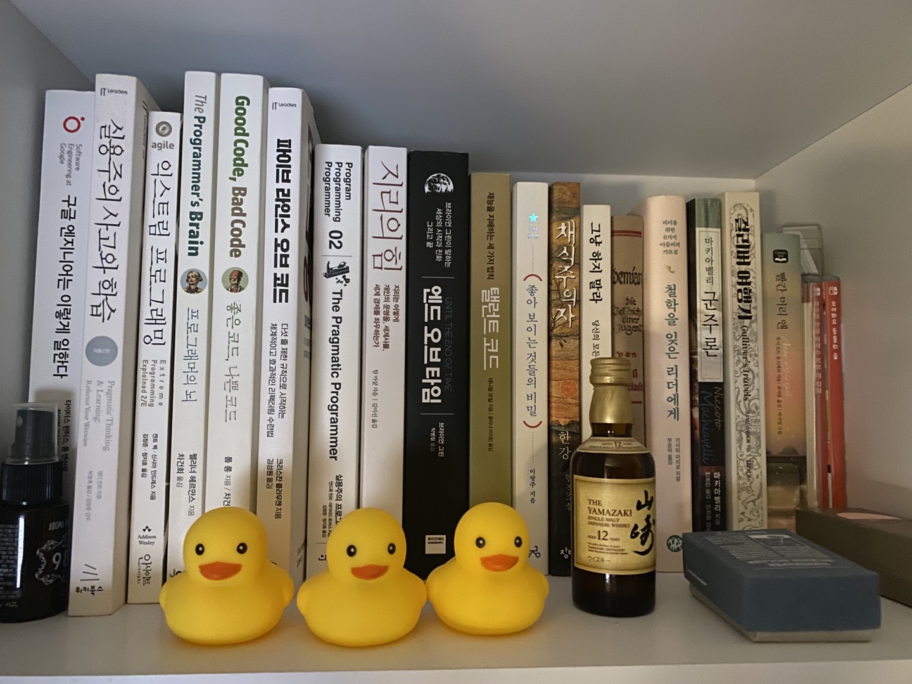
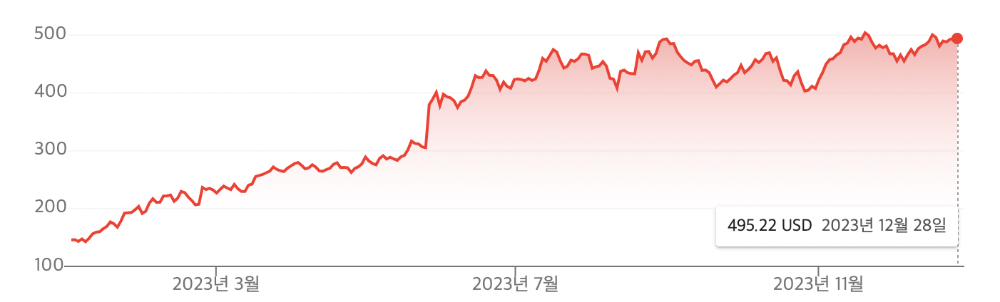
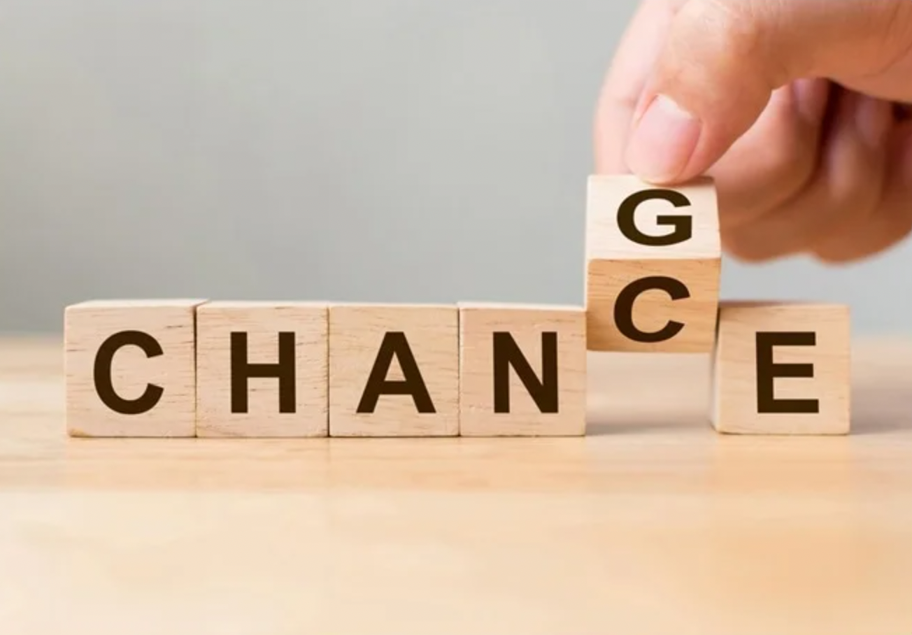

8번째 회고

올해도 올해의 회고에 앞서 작년 회고를 먼저 읽어보았다. 작년은 회사를 옮기고 나서 안정적인 한 해를 보냈고, 개발을 기술로만 바라보는 게 아닌 문제를 풀기 위한 도구로 바라보는 관점으로 옮겨가는 과정이었고, 성장에 있어서 작은 목표를 세우고 하루하루 지켜나가는 것이 나에게 맞는 툴이라는 것을 알게 된 해 였던 것 같다. 그렇다면 올해는 어땠는가?

## 회사
팀원들이 생기고 작은 팀이지만 팀을 리드하는 경험을 할 수 있었다. 이전까지는 해보지 못한 경험이었기 때문에 어렵지만 재밌기도 했다. 하지만 어떻게 보면 반쪽짜리 경험이었는데, 기술적으로는 리더의 역할을 한 것 같지만 매니징 측면에 있어서는 별다른 영향을 주지 못했다. 회사에서 나에게 그런 측면에서의 기대를 하지 않았다고도 할 수도 있지만 내가 자원했으면 될 일이었음에도 그러지 않았다.

기술적으로는 개인 기여자 이상의 역할을 한 것 같다. 뭔가 만들 때 구조에 대해 고민하고, 재사용할 수 있게 만드는 것에 앞서 재사용할 수 있게 만들 필요가 있는가를 생각하고, 코드의 의미를 오해하지 않게 하려면 어떤 규칙이 필요할지 등 “잘 만드는 것”에 더해 “함께”에 대한 고민이 녹아있는 코드를 한줄 한줄 썼던 것 같다. 

반면 아쉬웠던 부분은 팀원들이 좀 더 잘 기여하게 만들었다에 그쳤다는 점이다. 생산성을 더하는게 아니라 곱하는 역할을 하려면 팀원들도 개인 기여자에 그치는게 아니라 팀에 기여하도록 해야한다. 그것에 있어서 무엇보다 중요한건 동기부여인데 팀원들로 하여금 팀에 기여할 수 있는 동기를 부여시켜주지는 못했던 것 같다.

내년에는 이 조직에 합류한 지 만 3년 정도가 된다. 지금 이곳에 불만이 있진 않지만 아직은 한곳에 안주하기보단 새로운 경험이 필요한것 같아서 아마 조직 이동을 할 것 같다는 생각을 막연하게 가지고 있다. 

## 책
올해도 하루에 20페이지씩 읽다 보니 총 20권 정도의 책을 읽었다. 회사에서 개인 기여자 이상의 무언가를 하려는 노력을 하다 보니 자연스럽게 평소에도 그것과 관련된 것들을 접하게 되었다. 인문, 역사, 경제에 대한 관심이 개발과 관련이 없지 않구나, 문제 해결에서 통찰은 이런 데서 나오는 게 아닐까? 하는 생각을 하게 되었다. 얻은 생각들을 날아가게 두지 말고 기록하고, 연결하고, 결합해서 내 것으로 만들도록 하는 노력을 해야 한다. 그리고 무엇보다 “책 한 권 읽은 사람이 되지말자” 라는 평생 가져가야 할 숙제를 만든 한 해였다.

가장 재밌었던 책 [조영호 - 오브젝트]
객체 지향과 관련되어 있지만, 클래스가 어쩌고 하는 문법 설명이 아니라 주로 “책임 할당”에 대한 것을 설명한다. 코딩은 현실의 문제를 컴퓨터 세계로 옮겨와서 푸는 과정이고 그 과정에서 현실을 흉내 내기 위해 엔지니어가 주로 하는 작업은 “어떤 코드에 어떤 책임을 할당할지”를 고민하는 것이다.(FE에서는 어떤 컴포넌트가 어떤 책임을 갖게 할지 일 것이고) 이 책을 읽고 한동안 고양되어서 배운 걸 의식적으로 회사 코드에 써먹었던 기억이 난다.

가장 아쉬웠던 책 [에릭 하다 보니 - 도메인주도설계]
필독서로 뽑는 사람도 많은 책이다. 내가 제대로 읽지 못해서 + 소양이 부족해서인 것도 있지만, 내용이 뭔가 뜬구름 잡는다는 느낌이 있었고 두꺼운 책임에도 도메인주도 설계라는 게 이런 거다 라는 막연한 느낌 정도 외에는 머릿속에 남는 게 없었다. 그저 시작했으니까 끝내자는 마인드하나로 버티면서 읽은 느낌이다. 보통 재미없더라도 한번 시작한 건 끝까지 읽는 편인데 앞으로는 재미없는 책은 빠르게 그만두는 게 났겠다 싶었다

## 주식
작년 회고에 보니 엔비디아 주가가 재작년에 오른만큼 그대로 떨어져서 실망했던것 같다. 하지만 2022년 12월 30일 146달러 였던 엔비디아 주가는 2023년 12월 28일 495달러가 되었다. 

경제, 주식 관련 주장들은 항상 결과론만을 이야기하는 게 아닌가 라는 고정관념이 있었는데, 최근 “돈의 심리학”이라는 책을 읽으면서 생각이 바뀌었다. 엔비디아라는 회사의 주가처럼 주식은 언제든 오를 수 있고 떨어질 수도 있다. 예측할 수 없다는 건 팩트이고 중요한 건 “지속할 수 있는가, 하락에 패닉하지 않을 수 있는가, 0이 되지 않도록 하게 하기 위해 리스크를 줄일 수 있는가”, 같은 내용이었는데 이 내용은 내가 하는 일에도 적용할 수 있는 내용이 아닌가 싶었다. 지금 당장 최선의 선택을 못하더라도 리스크를 줄이는 것, 지속가능한 코드를 유지하는 것, 내 소신과 생각을 갖는 것 이런것들은 평소에도 공부해왔던 것들이었다. 많은 것들을 관통하는 중요한 가치는 사실 비슷한 것들이지 않을까

## 운동
올해는 160번 정도 운동을 갔다. 주 4회가 목표였기에 200번 정도 갔어야 하는데 거의 주 3회 정도밖에 못 간 것 같다. 내년에는 결혼 준비로 바빠질 것 같지만 나이도 한 살 느는 만큼 핑계 만들지 말고 지금 한 것 처럼 꾸준하게 그리고 안전하게 건강해지자

----

마치 주식처럼 많은 것들은 예측할 수 없고 항상 변화한다.

나는 여행을 좋아해서 1년에 한 번은 해외든 국내든 장기 여행을 다녔었는데, 어느 날 이동진 평론가님의 유튜브였던가… 에서 본 글귀 중 “아무리 여행을 좋아해도 평생 여행을 다닐 수는 없으니 이건 행복일 수 없다. 행복은 반드시 일상에서 찾아야 한다. 지속할 수 없으면 행복이 아닌 쾌락이다” 라는 말이 머릿속에 계속 맴돌았다. 그 이후 딱히 어딘가로 훌쩍 떠나고 싶다는 생각이 들지 않았다. 그리고 “여행과 사유로부터 통찰을 얻는다”라는 내 소개를 “일상과 사유로부터 통찰을 얻는다”라고 바꾸었다.

신입 개발자 시절, 기술만을 좋아하던 내가 어느샌가 팀 단위의 무언가를 생각하고 기술보다 훨씬 중요한 건 사람이다, 인문학이 중요하다, 결국 사람이 하는 일이다 라는 말을 하고 다닌다.

변화하지 않는 건 변화한다는 사실밖에 없다. 그리고 예측할 수 없다. 할 수 있는 최선은 변화한다는 걸 인정하고, 받아들이고, 대비하는 것이다. 라는 게 올해의 한 문장이다.

