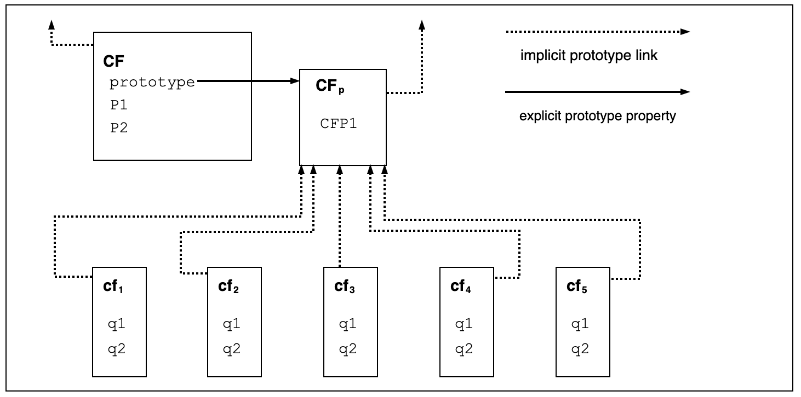

자바스크립트는 프로토타입 기반의 동적 다중 패러다임 스크립트 언어로, 객체지향형, 명령형, 선언형(함수형 프로그래밍 등) 스타일을 지원한다.(by MDN)  
자바스크립트의 **프로토타입**이란 무엇이고, 어떤 모습인지에 대해 정리하려한다.

-----

## 객체의 생성
자바스크립트는 많은 종류의 객체들로 이루어졌다고 해도 크게 틀린말은 아니다. 자바스크립트에서 원시 타입(Primitives : string | number | bigint | boolean | null | undefined | symbol)를 제외하고는 모두 객체이기 때문이다. 그리고 객체를 생성할 때, 생성된 객체는 그것의 원형을 표현하기 위한 역할을 수행하는 또 다른 객체를 참조하게 되는데, 이 객체를 프로토타입이라고 부른다. 많은 객체지향 언어에서 객체의 원형이 되는 개념으로 사용하는것은 "클래스"이다. 하지만 자바스크립트는 클래스가 아닌 프로토타입을 통해 객체를 생성한다.

자바스크립트에서 `function` 문법을 통해 정의한 일반적인 함수는 생성자 함수로 사용 할 수 있다. 그리고 생성자 함수를 `new` 키워드와 함께 사용해 객체를 생성하는 아래와 같은 과정을 거친다.

1. 새로운 빈 객체를 생성한다.
2. 생성한 객체에 `__proto__`라는 프로퍼티를 만들고 생성자 함수의 prototype의 레퍼런스를 할당한다.
3. 생성자 함수에서 선언한 this 속 프로퍼티들을 만든 객체에 할당한다.
4. 그렇게 생성된 객체를 반환한다.

이때, 프로토타입의 사용과 직접적으로 관련이 있다고 할 수 있는 `생성한 객체에 __proto__라는 프로퍼티를 만들고`, `생성자 함수의 prototype의 레퍼런스를 할당한다` 단계를 나누어 생각해 볼 수 있다.

#### 생성한 객체에 `__proto__` 라는 프로퍼티를 만들고
모든 객체는 `__proto__`라는 프로퍼티를 가지고 있다. 이 프로퍼티에 접근하면 내부적으로 빌트인 메소드인 `Object.getPrototypeOf`가 호출되어 해당 객체의 부모격 객체라고 할 수 있는 프로토타입 객체를 반환한다. 즉, 어떤 객체의 프로토타입또한 객체이기 때문에 프로토타입의 프로토타입의 프로토타입... 처럼 프로토타입체인이 일어날 수 있다.

#### 생성자 함수의 prototype의 레퍼런스를 할당한다
자바스크립트에서 함수는 객체이다. 모든 객체가 `__proto__`라는 프로퍼티를 가지고 있는 반면, 그 중 function키워드로 생성한, 생성자 함수로 사용될 수 있는 함수들은 prototype이라는 프로퍼티를 가지고있다. 이 프로퍼티가 참조하는 객체는 이 함수가 생성자 함수로 사용되었을때 자식객체가 `__proto__` 프로퍼티를 통해 참조하도록 할 객체이다.
 그리고 prototype프로퍼티를 통해 참조하는 이 객체는 `constructor`라는 프로퍼티를 가지고 이 프로퍼티는 생성자 함수를 다시 참조한다.

> 함수도 객체이므로, 모든 함수는 `__proto__`프로퍼티를 통해 함수의 원형이 되는 객체를 참조한다

> Arrow function 문법을 통해 생성한 함수는 prototype을 가지지 않을 뿐만아니라 자신의 this를 bind하지 않는다. 따라서 **생성자 함수로 사용할 수 없다.**

아래는 이해를 돕기위해 [tc39 명세](http://zeldahagoshipda.com)에서 발췌한 그림이다.

CF가 생성자 함수이고 cf<sub>1</sub> ~ cf<sub>5</sub>가 new 키워드를 통해 생성한 CF의 인스턴스, CF<sub>p</sub>가 CF의 프로토타입이다. 
명세에서는 `__proto__`를 암시적 프로토타입 링크

> 그림에는 표기되어있지 않지만 CF<sub>p</sub> 또한 contructor 프로퍼티로 CF에 접근할 수 있다.

## 상속
상속은 객체지향에서 매우 중요한 개념이다. 자바스크립트에서도 `class ... extends ...` 키워드를 통해 상속을 구현할 수 있다. 하지만 자바스크립트는 여타 언어들과는 다르게 내부적으로 `class`라는 개념이 존재하지 않는다. 따라서 당연히 상속도 존재하지 않는다. `class` 와 `extends`는 사실 프로토타입을 통해 잘 동작하도록 구현해놓은 Syntactic sugar 이다. `class`가 생기기전의 자바스크립트에서도 객체지향적으로 코드를 작성하기위한 숱한 노력들이 있었고, [익히 알려진 여러가지 방법](https://davidshariff.com/blog/javascript-inheritance-patterns/)들이 존재한다. 그것을 매끄럽게 사용할 수 있도록 내부적으로 구현해놓은 문법이다.

```js
class Parent {
  등짝스매싱(){
    console.log('철썩');
  }
  밥먹기(){
    console.log('냠냠');
  }
}

class Child extends Parent {
  용돈드리기(){
    console.log('입금');
  }
  밥먹기(){
    console.log('쩝쩝');
  }
}

var me = new Child();
```
위 코드에서 프로토타입관계가 어떻게 연결되는지를 보면 좀 더 이해가 쉽다.


예를들어 `me.등짝스매싱()`을 호출하면 우선 `me`안에서 `등짝스매싱`을 찾는다. 하지만 존재하지 않기 때문에 그것의 원형인 `Child.prototype`을 찾는다. 그곳에도 없기 때문에 또 그것의 원형인 `Parent.prototype`을 찾는다. 그리고 `등짝스매싱`이라는 함수를 발견하고 호출한다.

-----

프로토타입은 실무에서 사용할 일이 많이 없지만, 자바스크립트의 근간을 이루는 중요한 개념이다. 어렴풋이라도 알고있으면 동료 개발자의 "자바스크립트에는 왜 클래스가 없어요?" 라는 질문에 답변하는데라도 분명 도움이 되지않을까 싶다. 