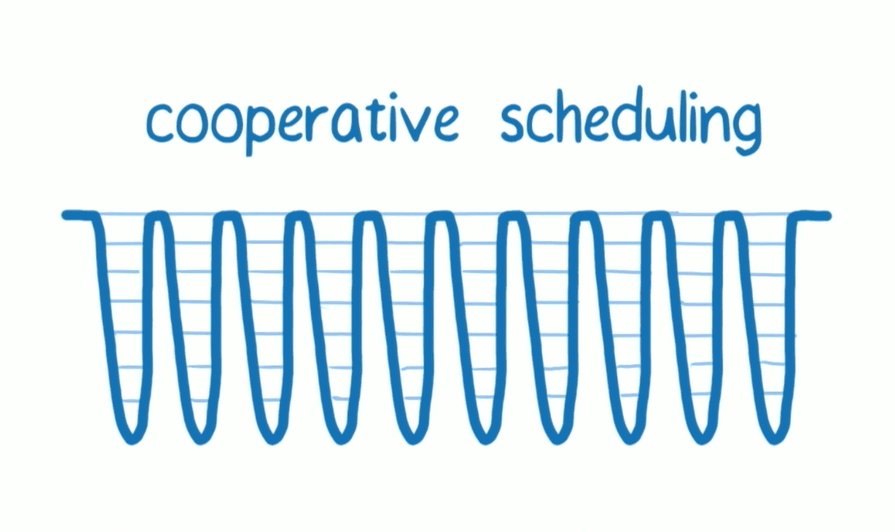

React는 이제 너무나 유명해서 프론트엔드쪽에 종사하고 있지 않더라도 키워드 정도는 접해본 분들이 많은 것 같습니다. 그래서 가끔 팀 동료들에게 그 유명한 React가 뭐 하는 라이브러리인가요? 라는 질문을 듣곤 합니다. 그럴 때마다 장황한 설명을 덧붙이게되는 제 자신을 돌아보면서 한번 정리할 필요가 있겠다는 생각으로 사내에서 스몰 세미나를 준비했고, 이 포스트는 그것에 덧붙여 정리한 글입니다. 내용이 사실과 다른 부분이 있다면 도움을 주시길 부탁드립니다.

## TL;DR

React는 효과적인 스케줄러를 통해 Tree비교를 수행하는 라이브러리입니다.

## What is React


공식 도큐먼트를 살펴보면 React는 "사용자 인터페이스를 만들기 위한 JavaScript 라이브러리"라고 설명하고 있습니다. 그리고 "선언형", "컴포넌트 기반", "한 번 배워서 어디서나 사용하기"라는 철학을 가지고 있다는 것을 알 수 있습니다.

그 중 "선언형"이라는 의미는 "어떻게" 보다 "무엇을"하는지에 집중하는 방식을 일컫습니다. 즉, "어떻게" 부분은 React에서 담당하겠다는 것입니다. 그리고 여기서의 "어떻게"란 "화면에 어떻게 그릴지"를 말합니다. 개발자는 "무엇을" 그릴지에 집중할 수 있습니다.

React에서 사용자 인터페이스는 상태에 기인합니다. 상태가 변경되면 React는 화면을 업데이트(화면을 다시 그릴지 말지를 결정하고, 필요하다면 다시 그림)합니다. 이때 React는 내부적으로 Tree를 만들어 메모리에 저장해놓습니다. 해당 Tree는 정말 단지 Tree입니다. 이 Tree에 "어떤 의미"를 부여할지가 React가 어디에 쓰일지를 결정합니다. 일반적으로 이 Tree는 화면에 그릴 인터페이스를 표현 합니다. 예를 들어 React가 가장 많이쓰이는 브라우저 환경에서는 DOM Tree를 표현하는 Tree입니다.

> 초기에는 이렇게 만들어진 Tree를 Shadow DOM이라고 불렀습니다. 이 용어는 틀린건 아니지만 멘탈모델을 헷갈리게 할 수 있는 단어이기 때문에 현재는 많이 사용되지 않습니다. React가 생성하는 Tree는 DOM만 표현할 수 있는 것이 아닙니다. 예를 들어 React native 에서는 DOM을 표현하지 않습니다.

## React가 하는 일

React팀이 사용자 인터페이스를 잘 만들기 위해 고민한 결과는 Reconciliation과 Scheduling으로 요약할 수 있습니다.

### Reconciliation
Reconciliation은 Tree끼리의 비교를 수행해서 변경될 부분을 결정하는 React의 알고리즘입니다. React의 시작은 보통 아래와 같습니다.

```tsx
ReactDOM.render(
  <div>Hi, React!</div>,
  document.getElementById('root')
);
```

`ReactDOM.render` 메소드는 React 엘리먼트를 전달한 DOM 엘리먼트에 렌더링 합니다. 이때 내부적으로 React 엘리먼트의 Tree를 만들고 이후의 업데이트는 Reconciliation을 통해 이루어집니다. 다시말해, 현재 상태를 표현하는 Tree가 존재할때 상태가 변경되면 변경된 상태를 표현하는 Tree를 구축한 후, 존재하던 Tree와 새로만든 Tree를 비교해서 실제로 화면에 그릴 곳을 결정합니다.

또한 Tree비교와 실제로 화면에 그리는 렌더링 단계는 따로 이루어집니다. DOM은 React가 동작하는 하나의 환경일 뿐이기 때문에 적당한 렌더링 환경만 구현한다면 React의 Tree비교 알고리즘은 그대로 가져다 쓸 수 있습니다. 따라서 React Native와 같은 파생 프로젝트가 등장할 수 있습니다.

React는 몇 가지 [휴리스틱한 가정](https://ko.reactjs.org/docs/reconciliation.html#the-diffing-algorithm)(React를 사용해 개발할 때 개발자가 지켜야할 규칙들)을 통해 이 과정을 단순 Tree비교에 비해 훨씬 빠르게 진행합니다.

### Scheduling
React는 내부적으로 사용자 인터페이스를 표현하는 Tree를 만들고 Reconciliation 과정을 통해 렌더링 할 부분을 결정합니다. 하지만 사용자 인터페이스를 잘 만들기 위해서는 Tree를 만들고 비교하는 과정을 어떻게 사용자에게 invisible 하게 느끼게 할지를 함께 고민해야 합니다. 이 과정들은 모두 비용(그것도 상당히 비싼)이기 때문입니다. 만약 Tree를 만들고 비교하는 것이 매우 무거워서 애플리케이션이 버벅대거나 끊기는 느낌을 준다면 좋은 유저 경험을 제공할 수 없습니다. 이를 위해 React는 내부적으로 스케줄러를 구현합니다.

> JavaScript의 런타임인 브라우저 환경은 싱글스레드 입니다. 즉, 뭔가 오래 걸리는 task(예를 들어 React의 Tree비교)가 메인스레드를 점유하고 있다면 화면을 그릴 수 없습니다. 렌더링 또한 메인스레드의 역할이기 때문입니다.

React 컴포넌트는 아래와 같이 생겼습니다.

```tsx
// 클래스형 컴포넌트
class Welcome extends React.Component {
  render() {
    return <h1>Hello, {this.props.name}</h1>;
  }
}

// 함수형 컴포넌트
function Welcome(props) {
  return <h1>Hello, {props.name}</h1>;
}
```

여기서 주의 깊게 보아야 하는 부분은 React에서 컴포넌트라고 부르는 개념은 사실 JavaScript의 함수 혹은 클래스이며 **"프로그래머가 호출하는 것이 아닌 React가 호출한다"** 는 것입니다. 즉, 제어권을 React에서 가지고 있습니다. 제어권을 React에서 가져가는 것은 효율적인 스케줄링을 하기 위함입니다. 프로그래머는 실제 화면을 업데이트하는 api를 언제 어떻게 호출할지를 신경 쓸 필요가 없습니다. 프로그래머가 화면을 변경하기 위한 방법은 React 내부에 선언된 상태를 변경하는 것입니다. 그리고 변경된 상태를 화면에 반영하는 것은 React의 역할인데, 이때 React는 **상태를 변경하자마자 그것이 바로 화면에 반영됨을 보장하지 않습니다.** 프로그래머가 상태를 변경하는 것은 사실 "상태를 변경하는 작업을 예약" 하는 것입니다. (따라서 setState와 같은 React의 상태 변경 api는 당연히 비동기입니다) 그리고 React는 예약된 상태 변경을 모아서 쓰레드의 유휴시간에 실행합니다. 사용자 인터페이스를 구현함에 있어서 Tree비교 작업보다 더 중요한 작업들이 존재하기 때문입니다.

그리고 React에서 이런 일련의 작업들을 더 잘 수행할 수 있도록 하기 위해 React Fiber가 등장합니다.

## React Fiber

React Fiber는 일종의 코드네임이자 React 내부 자료구조라고 할 수 있습니다. React팀은 기존에 Reconciliation 방식에 한계를 느끼고 사용자 인터페이스 구현이라는 목적을 더 잘 달성할 수 있도록 로직을 재작성합니다.

React Fiber는 React 16버전부터 본격적으로 도입되었습니다. 그 이전 버전의 React는 Reconciliation을 재귀적으로 수행했습니다. 재귀는 Tree 비교에 있어서 꽤 적절한 방법이기 때문입니다. 하지만 재귀는 브라우저가 싱글스 레드 환경이기 때문에 문제가 발생합니다. 재귀의 가장 큰 문제는 **"실행 중인 컨텍스트로 돌아올 수 없다"** 는 것입니다. 즉, 현재 React에서 수행하고 있는 Tree diff 비교 작업이 오래 걸리는 작업이라면 브라우저는 그 작업이 끝날 때까지 blocking되어버린다는 것입니다.

커다란(비싼) 작업이 존재할때 이를 처리하는 방법은 두가지 정도로 생각해 볼 수 있습니다.

1. 멀티스레드를 사용한다
> 모던 브라우저는 웹 워커등을 통해 멀티스레드를 사용할 수 있지만 DOM 핸들링은 오로지 메인스레드만 수행 할 수 있습니다.

2. 작은 작업으로 쪼갠다
> 재귀의 문제점은 커다란 작업을 작은 작업으로 쪼갤 수 없다는 것 입니다. 커다란 작업을 재귀적으로 실행중에 더 우선순위 높은 작업이 들어오면 해당 작업을 중단하는데, 그 이후 우선순위 높은작업이 끝나더라도 방금 실행중이던 재귀의 중간으로 돌아갈 수 없습니다.

이런 문제가 있기때문에 React팀은 기존에 재귀적 Reconciliation로직을 Linked List기반으로 재작성하고 React Fiber라는 이름을 붙입니다.

React Fiber는 React내부에서 사용되는 call stack이며 작업단위 입니다. 마치 React만의 스레드라고도 생각할 수 있습니다.

React Fiber는 다음과 같은 목적을 달성하기위해 구현되었습니다.

- 작업을 중지하고 필요할때 다시 돌아가서 재개할 수 있습니다
- 우선순위를 조정할 수 있습니다
- 재사용 가능합니다

React Fiber로 인해 기존에 브라우저를 blocking시킬 수 밖에 없던 커다란 작업들을 쪼개고, 브라우저는 쪼갠 작업들의 사이사이에 화면을 그릴 수 있게 되어 사용자에게 더 좋은 경험을 제공할 수 있게 되었습니다.



React Fiber를 통해 비 선점형 멀티태스킹을 구현합니다 [(그림 출처)](https://www.youtube.com/watch?v=ZCuYPiUIONs&t=1752s)

## Conclusion

React는 사용자 인터페이스 구현을 위해 한 가지를 정말 "잘 하는" 라이브러리입니다. 언젠가 분명 React의 시대가 끝나겠지만 (사실 stack overflow 기준으로 가장 많이 사용하는 라이브러리는 아직 jQuery지만...) 분명한 건 웹 개발의 역사에 있어서 한 획, 그것도 굵직한 한 획을 그은 라이브러리라는 것은 분명한 사실이라고 생각합니다.

---

참고자료  
[https://ko.reactjs.org/](https://ko.reactjs.org/)  
[https://github.com/acdlite/react-fiber-architecture](https://github.com/acdlite/react-fiber-architecture)  
[https://youtu.be/ZCuYPiUIONs](https://youtu.be/ZCuYPiUIONs)  